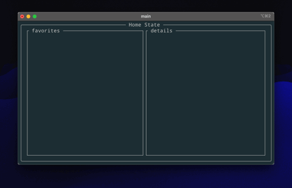

# Kraken TUI
[](#license)
[](https://www.rust-lang.org)
[](https://github.com/ceppelli/kraken-tui/actions/workflows/rust.yml)
[](https://codecov.io/gh/ceppelli/kraken-tui)


### CLI client for the Kraken Crypto Exchange implemented in Rust

This project aim to create a simple but fast and usefull client for connecting to the Kraken Exchange API binary endpoint.


## ⚠️ This project is still under fluid development and must be considered as alpha version ⚠️



## Features

| Feature            | Status |
| :---               | :---:  |
| list assets        | ✅ |
| list asset pairs   | ✅ |
| ticket info        | 📐 |
| multi threaded     | 📐 |
| user auth          | 🔮 |
| user ballance      | 🔮 |
| user open order    | 🔬 |
| user cloded order  | 🔬 |
| user trade history | 🔮 |
| order book         | 🔬 |
| recent trades      | 🔬 |
| recent spreeds     | 🔬 |


* ✅ - completed
* 📐 - design
* 🔮 - planed
* 🔬 - investigation

---

## Building from Source
kraken-tui is written entirely in Rust and building it from source is dead simple. All you have to do is download source, install rust and build with cargo.

1) Installing rust. Head to [Rust installation](https://www.rust-lang.org/tools/install). It is basically doing
```
curl --proto '=https' --tlsv1.2 -sSf https://sh.rustup.rs | sh
```
2) Get the source code. You can [download from the archives]() or use git clone:
```
git clone https://github.com/ceppelli/kraken-tui.git
```

3) `cd` into source root and do:
```
cargo build --all --release
```

4) The compiled binary is located in `target/release/` directory. Copy the `kraken_tui` binary and place it somewhere where it is easy to run. Preferrably under `$PATH`.

5) kraken-tui is now ready to fire. [Head over to usage](#usage)

---

## Usage

kraken-tui is single binary so it shouldn't be difficult to run. Just make sure you have [installed the required dependencies](#dependencies).

### Run kraken-tui
```
kraken_tui
```
### Show help message
At any time inside the running binary press the key `?` and a contextual help view will be displayed.


## License

Copyright 2022-2023 Luca Ceppelli

Licensed under the MIT license
<LICENSE-MIT or [https://opensource.org/licenses/MIT](https://opensource.org/licenses/MIT)>. Files in the project may not be
copied, modified, or distributed except according to those terms.